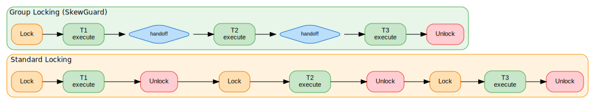
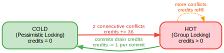
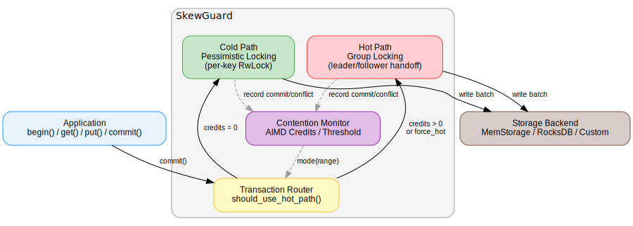

# SkewGuard

**Contention-adaptive concurrency control for transactional key-value workloads.**

```
cargo add skewguard
```

## The Problem

Real-world key-value workloads are skewed. On the NYSE, 40 stocks account for 60% of daily volume. On WeChat Pay, a single red envelope event drives 14 million transactions per second to a handful of counter keys. In any e-commerce flash sale, one inventory row absorbs orders of magnitude more writes than everything else combined.

When a small number of keys receive a disproportionate share of writes, transactional storage systems collapse. This is the **hot key problem**, and every production database suffers from it.

## Why Current Solutions Fall Short

Every production database — CockroachDB, TiDB, YugabyteDB — uses pessimistic locking (2PL) for write concurrency. Each transaction independently acquires a lock, executes, and releases it:

<p align="center">
  
</p>

With standard locking, every transaction pays the full lock acquire/release cost, and there's a gap between consecutive executions. Three things go wrong under high contention:

1. **Lock management overhead dominates.** Each acquire and release is a CAS operation, a hash table lookup, and a memory barrier. When the actual work is incrementing a counter, the lock machinery costs more than the business logic.

2. **Lock convoys form.** 100 transactions queue on the same key. Each one independently acquires and releases the lock, creating a gap between every consecutive execution. No transaction can start until the previous one has fully released.

3. **The standard answer is range splitting.** CockroachDB and TiDB detect hot ranges and split them. But splitting is slow (seconds), reactive (damage is done before the split happens), and fundamentally cannot help when the hot key is a single row that can't be split further.

The core issue: **every system picks one concurrency control strategy at design time and uses it for all keys regardless of contention level.** There is no mechanism to treat hot keys differently from cold ones at the execution layer.

## How SkewGuard Solves This

SkewGuard runs two execution paths and switches between them automatically based on observed contention:

**Cold path** — standard per-key pessimistic locking. Minimal overhead when conflicts are rare. This is what CockroachDB and TiDB do.

**Hot path** — group locking with leader/follower handoff. The lock is held continuously by the group. The first transaction becomes the leader. When it finishes, it directly hands off leadership to the next waiting transaction — the lock is never released and re-acquired. This eliminates per-transaction lock overhead entirely.

**Automatic switching** — an AIMD credit system detects contention and switches ranges between paths. No tuning, no timers, fully self-regulating.

<p align="center">
  
</p>

This means:
- Cold keys pay no overhead beyond standard locking
- Hot keys get group locking automatically when contention appears
- The switch back happens naturally when contention subsides
- Application code doesn't change

## Architecture

<p align="center">
  
</p>

SkewGuard is storage-agnostic. It sits between your transaction API and any storage backend that implements the `Storage` trait. The contention monitor feeds mode decisions to the transaction router, which selects the cold or hot path for each commit.

## Benchmark Results

YCSB-A workload (50% read, 50% read-modify-write), 8 threads, 10K keys, RocksDB backend, Zipfian access distribution:

| Skew (theta) | Pessimistic | Group Lock | Adaptive | Gain vs Pessimistic |
|:------------:|:-----------:|:----------:|:--------:|:-------------------:|
| 0.6 (mild) | 232 K ops/s | 296 K ops/s | **293 K ops/s** | +26% |
| 0.8 | 225 K ops/s | 293 K ops/s | **294 K ops/s** | +31% |
| 0.9 | 213 K ops/s | 286 K ops/s | **288 K ops/s** | +35% |
| 0.95 | 196 K ops/s | 274 K ops/s | **274 K ops/s** | +40% |
| 0.99 (extreme) | 187 K ops/s | 277 K ops/s | **282 K ops/s** | +48% |

Pessimistic locking degrades as skew increases — throughput drops 19% from theta 0.6 to 0.99. Group locking stays flat. Adaptive matches group locking across all skew levels.

```bash
cargo bench --features rocksdb -- "rocks_"
```

## API Examples

### Basic: Read, Write, Delete

```rust
use skewguard::{SkewGuard, Config};
use skewguard::mem::MemStorage;

let sg = SkewGuard::new(MemStorage::new(), Config::default());

// Simple write.
let mut txn = sg.begin();
txn.put(b"user:1:name", b"Alice");
txn.put(b"user:1:balance", b"1000");
txn.commit().unwrap();

// Read.
let mut txn = sg.begin();
let name = txn.get(b"user:1:name").unwrap();
assert_eq!(name, Some(b"Alice".to_vec()));

// Delete.
let mut txn = sg.begin();
txn.delete(b"user:1:name");
txn.commit().unwrap();
```

### Read-Modify-Write (e.g., Balance Transfer)

```rust
let sg = SkewGuard::new(MemStorage::new(), Config::default());

// Seed accounts.
let mut txn = sg.begin();
txn.put(b"account:A", &1000i64.to_le_bytes());
txn.put(b"account:B", &500i64.to_le_bytes());
txn.commit().unwrap();

// Transfer 200 from A to B.
let mut txn = sg.begin();

let a_bytes = txn.get(b"account:A").unwrap().unwrap();
let b_bytes = txn.get(b"account:B").unwrap().unwrap();

let a_bal = i64::from_le_bytes(a_bytes.try_into().unwrap());
let b_bal = i64::from_le_bytes(b_bytes.try_into().unwrap());

txn.put(b"account:A", &(a_bal - 200).to_le_bytes());
txn.put(b"account:B", &(b_bal + 200).to_le_bytes());
txn.commit().unwrap();
```

### Handling Conflicts with Abort-Driven Promotion

When a transaction aborts, retry with `force_hot` to go directly to group locking. The abort itself is the fastest contention signal.

```rust
use skewguard::{SkewGuard, Config, Error, TransactionOptions};
use skewguard::mem::MemStorage;

let sg = SkewGuard::new(MemStorage::new(), Config::default());

fn increment_counter(sg: &SkewGuard<MemStorage>, key: &[u8]) {
    // First attempt: normal path.
    let mut txn = sg.begin();
    let val = txn.get(key).unwrap().unwrap_or_else(|| b"0".to_vec());
    let n: u64 = String::from_utf8(val).unwrap().parse().unwrap();
    txn.put(key, (n + 1).to_string().as_bytes());

    match txn.commit() {
        Ok(()) => return,
        Err(Error::Conflict) => {
            // Contention detected. Retry on the hot path.
            let opts = TransactionOptions { force_hot: true, ..Default::default() };
            let mut txn = sg.begin_with_options(opts);
            let val = txn.get(key).unwrap().unwrap_or_else(|| b"0".to_vec());
            let n: u64 = String::from_utf8(val).unwrap().parse().unwrap();
            txn.put(key, (n + 1).to_string().as_bytes());
            txn.commit().unwrap();
        }
        Err(e) => panic!("storage error: {e}"),
    }
}
```

### Pre-Declared Access Sets (Transaction Hints)

If you know which keys a transaction will touch, declare them upfront for immediate path routing — no need to wait for contention detection.

```rust
use skewguard::TransactionOptions;

// Stored procedure style: access set is known before execution.
let opts = TransactionOptions {
    declared_keys: Some(vec![
        b"inventory:SKU-001".to_vec(),
        b"order:12345".to_vec(),
    ]),
    ..Default::default()
};
let mut txn = sg.begin_with_options(opts);
// If either key is in a hot range, this transaction goes directly
// to group locking without trying the cold path first.
txn.put(b"inventory:SKU-001", b"99");  // decrement stock
txn.put(b"order:12345", b"confirmed");
txn.commit().unwrap();
```

### RocksDB Backend

```toml
[dependencies]
skewguard = { version = "0.1", features = ["rocksdb"] }
```

```rust
use skewguard::{SkewGuard, Config};
use skewguard::rocks::RocksStorage;

let storage = RocksStorage::open("/tmp/mydb").unwrap();
let sg = SkewGuard::new(storage, Config::default());

// Exact same API as MemStorage.
let mut txn = sg.begin();
txn.put(b"persistent:key", b"durable value");
txn.commit().unwrap();
```

### Custom Storage Backend

Implement the `Storage` trait to plug in any backend:

```rust
use skewguard::storage::{Storage, Snapshot, WriteBatch, Timestamp};
use skewguard::Result;

struct MyStorage { /* your state */ }

impl Storage for MyStorage {
    type Snapshot = MySnapshot;
    type WriteBatch = MyWriteBatch;

    fn snapshot(&self) -> MySnapshot { /* point-in-time view */ }
    fn write_batch(&self) -> MyWriteBatch { /* empty batch */ }
    fn commit(&self, batch: MyWriteBatch) -> Result<Timestamp> { /* atomic apply */ }
    fn current_timestamp(&self) -> Timestamp { /* monotonic clock */ }
    fn get_at(&self, key: &[u8], ts: Timestamp) -> Result<Option<Vec<u8>>> { /* versioned read */ }
    fn was_modified(&self, key: &[u8], after: Timestamp, at_or_before: Timestamp)
        -> Result<bool> { /* conflict check */ }
}
```

### Configuration

Default config uses AIMD credits (zero tuning):

```rust
use skewguard::{Config, ColdPathStrategy, MonitorStrategy};

// Default — self-tuning, no knobs to adjust.
let config = Config::default();

// Explicit AIMD configuration.
let config = Config {
    monitor_strategy: MonitorStrategy::Credit {
        initial_credit: 36,    // credits added on 2 consecutive conflicts
        hotness_threshold: 2,  // consecutive conflicts to trigger refill
        aimd_factor: 2,        // decay resistance for uncontended keys
    },
    num_ranges: 64,                          // keyspace partitions for tracking
    cold_path: ColdPathStrategy::Pessimistic, // what CockroachDB/TiDB use
};

// Threshold-based alternative with explicit control.
let config = Config {
    monitor_strategy: MonitorStrategy::Threshold {
        hot_threshold: 0.3,        // conflict rate to switch to hot
        cold_threshold: 0.1,       // conflict rate to switch back
        window_ms: 1000,           // sliding window
        min_hot_duration_ms: 5000, // hysteresis
        queue_depth_threshold: 32, // instant trigger on queue depth
    },
    ..Config::default()
};
```

### Observability

```rust
use skewguard::KeyRange;

// Check the mode of a specific key range.
let range = KeyRange::for_key(b"hot:key", 64);
let stats = sg.monitor().stats(range);
println!("mode: {:?}, credit: {}, conflicts: {}",
    stats.mode, stats.credit, stats.total_conflicts);

// List all currently hot ranges.
for stats in sg.monitor().hot_ranges() {
    println!("range {} is hot (credit: {})", stats.range.index, stats.credit);
}
```

## Design Details

### Group Locking (Leader/Follower Handoff)

Hot-path transactions on the same key are serialized via an mpsc channel. The first transaction becomes the leader. Followers wait on the channel. When the leader finishes, it sends a wake signal to the next follower, who becomes the new leader. The lock is never released between consecutive transactions. Different keys within the same hot range execute concurrently.

Commit ordering is enforced via monotonic sequence numbers. A transaction can only commit after all predecessors have committed.

### AIMD Contention Detection

Each key range maintains a credit counter. Two consecutive conflicts refill credits by `initial_credit` (default 36). Each successful commit drains one credit. When credits > 0, the range is hot. When they reach zero, the range returns to cold. No timers, no sliding windows in the default mode — the system self-regulates through usage.

### Crash Recovery

If a leader thread panics mid-execution:
- **Handoff timeout** (500ms): followers detect a dead leader and force-recover
- **LeaderGuard** (RAII): leadership is released in the `Drop` impl even on panic
- **Sequence watermark timeout**: if a predecessor never commits, the watermark advances so subsequent transactions proceed

## License

MIT OR Apache-2.0
